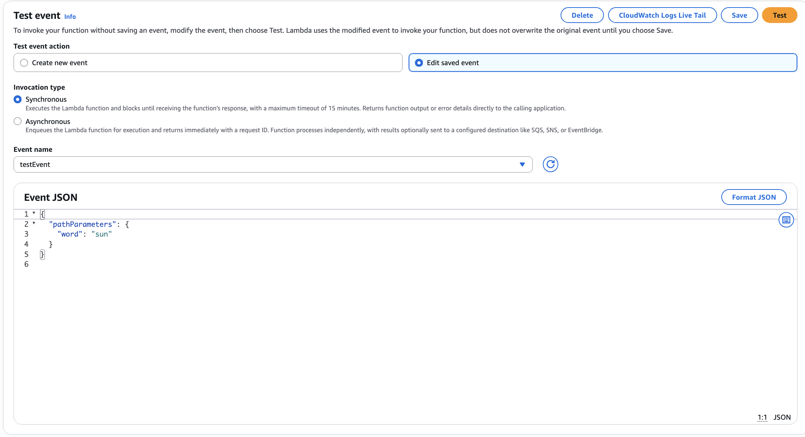
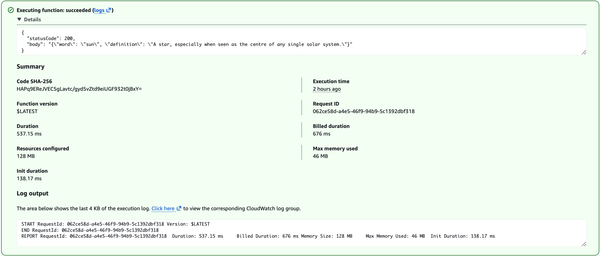
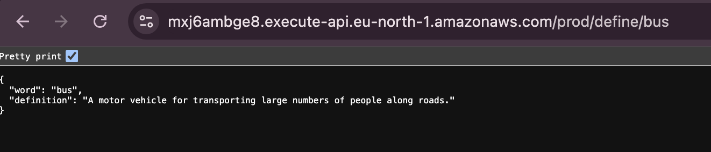

# Johdanto
Seminaarityöni aihe on syventyä tarkemmin AWS:n (Amazon Web Services) ja serverless-ratkaisujen pariin sekä tarkastella kyseisen arkkitehtuurin haittoja ja rajoitteita osana sujuvaa ohjelmistokehityksen prosessia. Serverless-arkkitehtuuri, eli Function-as-a-Service (FaaS) on tapa luoda sovelluskehityksessä ketterä infrastruktuuri sovellukselle ilman paikallista palvelinta. Tämän raportin lisäksi olen luonut avointa API:a hyödyntävän sanakirja-sovelluksen tukeakseni oppimistani ja ymmärrystäni kyseisen arkkitehtuurin parissa. 

## Sovelluksessa käytetyt teknologiat
- AWS Lambda
- API Gateway
- Python

## Sovelluksen rakenne
Sovellus käyttää yksinkertaista funktiota hakeakseen avoimesta API:sta annetulle sanalle merkityksen. Tarkemmin, API Gateway vastaanottaa URL:in muodossa /define/{word}. Lambda-funktio vastaanottaa kyseisen parametrin, kutsuu ulkoista DictionaryAPI:a (https://dictionaryapi.dev/) ja tämän jälkeen Lambda palauttaa JSON-muotoisen selityksen. 

### Kirjastojen tuonti
```python
import json
import urllib.request
```

### Haetaan käyttäjän syöttämä sana URL:ista ja palautetaan virhe, mikäli sana puuttuu
```python
def lambda_handler(event, context):
    word = event.get("pathParameters", {}).get("word", "")

    if not word:
        return {
            "statusCode": 400,
            "body": json.dumps({"error": "No word provided"})
        }
```

### Tehdään HTTP-pyyntö API:in ja otetaan ensimmäinen annettu määritelmä sanalle
```python
    url = f"https://api.dictionaryapi.dev/api/v2/entries/en/{word}"

    try:
        with urllib.request.urlopen(url) as response:
            data = json.loads(response.read().decode())

        definition = (
            data[0]["meanings"][0]["definitions"][0]["definition"]
            if data else "No definition found."
        )
```

### Palautetaan joko onnistunut (200 OK) tai epäonnistunut (404 error) vastaus
```python
        return {
            "statusCode": 200,
            "body": json.dumps({
                "word": word,
                "definition": definition
            })
        }

    except Exception:
        return {
            "statusCode": 404,
            "body": json.dumps({"error": f"No definition found for '{word}'"})
        } 
```

# Serverless-arkkitehtuurin hyödyt ja rajoitteet

Serverless-arkkitehtuurin lukeutuu useita hyötyjä, mutta muutamia rajoitteita myös. Ensisijaisen hyvä puoli serverless-raitkaisussa on ketterä sovelluskehitys ja ylläpito (ei ylläpidettäviä tai vaikeasti optimoitavia palvelimia), koska infrastruktuuri on täysin pilvipalvelun tarjoajan vastuulla. Myös erittäin toimiva hinnoittelumalli on yksi hyödyistä, missä maksetaan vain toteutuneesta käytöstä ja tämä mahdollistaa palvelun hyvän skaalautuvuuden ja käytön niin pieniin kuin suuriin projekteihin. Tarkastellessa hintoja (https://aws.amazon.com/ec2/pricing/on-demand/) voi huomata, että palvelun käyttö on edullista. Mainittavana hyötynä on myös projektin automaattinen skaalautuvuus ilman konfigurointia, mikä tekee siitä erittäin lähestyttävän ratkaisun kaikenlaisille projekteille.

## Rajoitteet

Serverless-arkkitehtuuriin sisältyy myös muutamia rajoitteita. Muun muassa debuggaus ja korjaaminen on vaikeampaa, kuin perinteisemmässä sovelluskehityksessä ja virheiden löytäminen on monimutkaisempaa. Myös ns. "kylmä startti" voi rajoittaa palvelun optimaalista käyttöä. Kylmä startilla viitataan siihen, että kun Lambda-funktiota ei käytetä aktiivisesti AWS joutuu käynnistämään tämän uudestaan. Kylmästartit kestävät yleensä vain satoja millisekuntteja, joskus muutamia sekunteja, joten ongelma ei ole käytön kannalta merkittävä. Myös vain 1% pyynnöistä ovat kylmä startteja (https://aws.amazon.com/blogs/compute/understanding-and-remediating-cold-starts-an-aws-lambda-perspective/), joten "ongelma" on marginaalinen. 

# AWS:n käyttö

AWS-konsolissa Lambda-funktio lisätään konsoliin upotettuun koodieditoriin, mikä tekee kehittämisestä ketterää ja yksinkertaista.


## Testaus

AWS -konsolissa on simppeli tapa testata funktiota. Konsolissa luodaan uusi testitapahtuma, mihin annetaan JSON-muodossa pyyntö. Testin voi tallentaa myös myöhempää käyttöä varten ja ajaa konsolin sisällä, milloin testi palauttaa funktion lopputuloksen. 



### Testin tulos:



### URL:in kutsuminen selaimessa: 




## Yhteenveto

Ennen seminaarityötäni ymmärrykseni serverless-ratkaisuista oli erittäin pintapuolinen, mutta syventyessäni aiheeseen pääsin tutustumaan käytännön läheiseen AWS:n konfigurointiin, käyttöön ja tämän tuomiin hyötyihin. Serverless-arkkitehtuuri yksinkertaisuuden puolesta alentaa yrityksien kuluja huomattavasti ja yhtiöt kuten Netflix, Codepen ja Coca-Cola (https://dashbird.io/blog/companies-using-serverless-in-production/) sekä monet muut käyttävät kyseistä arkkitehtuuria ja tämän suosio on vielä tänäkin päivänä nousussa. Ennusteen mukaan (https://www.precedenceresearch.com/serverless-architecture-market) serverless-arkkitehtuurin markkina-osuus vuoteen 2030 mennessä jatkaa kasvuaan Euroopassa ja Aasiassa 13-15% vuosittain. Voikin siis todeta, että palveliton arkkitehtuuri on tullut jäädäkseen ja opiskellessani aihetta ymmärrän tämän suosion täysin.

## Lähteet:
- https://trepo.tuni.fi/bitstream/handle/123456789/25237/Ruutiainen.pdf;jsessionid=E6F236A02D2C5706D4C6A29AC8CB4846?sequence=4 (ei suoraa viittausta, käytetty aiheen opiskeluun)
- https://www.youtube.com/watch?v=Fvrlmjvxcc0 (ei suoraa viittausta, käytetty aiheen opiskeluun)
- https://dictionaryapi.dev/
- https://aws.amazon.com/ec2/pricing/on-demand/
- https://aws.amazon.com/blogs/compute/understanding-and-remediating-cold-starts-an-aws-lambda-perspective/
- https://dashbird.io/blog/companies-using-serverless-in-production
- https://www.precedenceresearch.com/serverless-architecture-market
